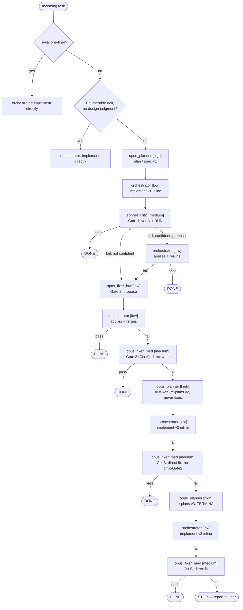

# Orchestration Routing Rules

> Two models, effort-tiered, three quality gates on the original plan, then a
> **bounded re-plan loop** (at most 2 rounds) with a lighter retry each time:
> **Opus-high plan/spec → orchestrator implements (inline) → Gate 1
> (Sonnet-medium critic, propose-if-confident) → Gate 2 (Opus-low, propose) →
> Gate 3 (Opus-medium, direct write) → [ladder exhausted] → Opus-high ALWAYS
> re-plans (never fixes directly) → orchestrator implements the new plan →
> Opus-medium fixes directly if needed (no critic, no Gate 2 this round) →
> [round 2, terminal] Opus-high re-plans once more → same lighter retry →
> STOP**.
> Corrected 2026-07-24: `opus_planner` must NEVER attempt a direct fix — its
> only terminal action is re-planning. This is bounded to two re-plan rounds,
> not unlimited.

```
Opus high   opus_planner: plan/spec (requirements, acceptance
            criteria, scope boundary, module ordering)
            terminal role: ladder exhausted → ALWAYS produces a
            NEW plan/spec, NEVER fixes code itself. Bounded to
            at most 2 re-plan rounds before STOP.

Sonnet low  orchestrator (you): route, implement code INLINE,
            APPLY any Gate 1/2 proposed fix verbatim + rerun the
            check, enforce policies, sweep packets

Sonnet med  sonnet_critic [Gate 1, ORIGINAL PLAN ONLY]: verify vs
            acceptance criteria, RUN tests/build (no run = no
            pass); propose a fix ONLY when confident, else
            evidence only — NEVER applies it, orchestrator does

Opus low    opus_fixer_low [Gate 2, ORIGINAL PLAN ONLY]: escalation
            only — diagnose + propose a fix (cross-model) — NEVER
            applies it, orchestrator does

Opus med    opus_fixer_med: TWO invocation contexts —
            (A) Gate 3 of the original-plan ladder: escalation only,
                WRITES AND APPLIES the fix directly, ONE shot
            (B) post-replan retry: invoked directly after the
                orchestrator implements a re-planned spec, NO
                critic/Gate 2 this round — writes and applies
                directly, ONE shot

────────────────────────  ORIGINAL PLAN  ────────────────────────

opus_planner ─► orchestrator implements ─► sonnet_critic [Gate 1]
 [high] (plan/spec)  [low] (inline)         [med] (verify, run,
                                             propose IF confident)
                                                  │
                            ┌─────────────────────┤
                            │ no confident         │ fix proposed
                            │ proposal             ▼
                            │              orchestrator applies
                            │              verbatim + reruns check
                            │                      │
                            │            ┌─────────┼─────────┐
                            │          pass       fail        │
                            │            ▼          │         │
                            │          DONE         │         │
                            └────────────────────────┘         │
                                                  ▼
                       opus_fixer_low [Gate 2, low]: propose fix
                            → orchestrator applies + reruns
                                     │ pass → DONE
                                     │ fail
                                     ▼
                       opus_fixer_med [Gate 3, medium]: writes +
                       applies directly, ONE shot  (Context A)
                                     │ pass → DONE
                                     │ fail
                                     ▼
              ══════════  LADDER EXHAUSTED  ══════════
                                     ▼
             ┌───────────  RE-PLAN LOOP (bounded, max 2 rounds)  ───────────┐
             │                                                               │
             │  opus_planner [high]: ALWAYS re-plans (v2), NEVER fixes       │
             │       → orchestrator implements v2, inline                   │
             │            → FAIL → opus_fixer_med [medium] fixes directly   │
             │                     (Context B — no critic, no Gate 2)       │
             │                          │ pass → DONE                       │
             │                          │ fail                              │
             │                          ▼                                  │
             │  opus_planner [high]: re-plans AGAIN (v3, TERMINAL round)    │
             │       → orchestrator implements v3, inline                  │
             │            → FAIL → opus_fixer_med [medium] fixes directly  │
             │                     (Context B — no critic, no Gate 2)      │
             │                          │ pass → DONE                      │
             │                          │ fail                             │
             │                          ▼                                 │
             │                STOP — report to user (no loops)             │
             └───────────────────────────────────────────────────────────┘
```

## Decision Tree

```
Incoming task
│
├─ Trivial mechanical one-liner (typo, comment, formatting)?
│   └─ YES → orchestrator does it directly. No pipeline, no delegation.
│
├─ Fully enumerable edits with no design judgment
│  (rename sweep, mechanical edit list)?
│   └─ YES → orchestrator executes directly. No subagent.
│
└─ Everything else (feature, bug fix, refactor, API/schema change —
   anything needing design judgment)
   └─ → opus_planner [high] plan/spec
         → orchestrator implements inline
           (orchestrator MAY route straight to opus_fixer_med instead,
            at its own judgment, when the spec is clearly beyond a
            first Sonnet-low pass — rare, discretionary, not a formal
            stage)
         → sonnet_critic [medium] verifies + runs   ── Gate 1 ──
              │
              ├─ pass → DONE
              │
              └─ fail (confident proposal → orchestrator applies + reruns,
                 or no confident proposal → straight through)
                   │ still fail
                   ▼
              opus_fixer_low [low] propose fix       ── Gate 2 ──
                   → orchestrator applies + reruns
                        │ pass → DONE
                        │ fail
                        ▼
              opus_fixer_med [medium] direct write   ── Gate 3 ──
                   │ pass → DONE
                   │ fail
                   ▼
              ════ ORIGINAL-PLAN LADDER EXHAUSTED ════
                   │
                   ▼
              opus_planner [high] — ALWAYS re-plans (v2), never fixes
                   → orchestrator implements v2
                        → fail → opus_fixer_med [medium] direct fix
                             (NO critic, NO Gate 2 this round)
                             │ pass → DONE
                             │ fail
                             ▼
                        opus_planner [high] — re-plans AGAIN (v3, TERMINAL)
                             → orchestrator implements v3
                                  → fail → opus_fixer_med [medium] direct fix
                                       (NO critic, NO Gate 2)
                                       │ pass → DONE
                                       │ fail
                                       ▼
                                  STOP. Report to user with full
                                  evidence trail. Never a third re-plan.
```

## Task Classification Guide

| Task Type | Owner |
|-----------|-------|
| Routing, delegation, policy enforcement, packet sweep | Orchestrator (you) |
| Implementation (from spec, original OR re-planned) | Orchestrator (you), inline |
| Trivial mechanical one-liners, enumerable edits | Orchestrator (you) |
| Applying a Gate 1/2 proposed fix + rerunning the check | Orchestrator (you), inline |
| Plan/spec (initial) AND every re-plan (always, never a fix) | `opus_planner` [high] |
| Gate 1 — verification, propose-if-confident (original plan only) | `sonnet_critic` [medium] |
| Gate 2 — cross-model diagnosis + propose (original plan only) | `opus_fixer_low` [low] |
| Gate 3 — direct write + apply (original plan, escalated) | `opus_fixer_med` [medium], Context A |
| Post-replan direct fix (no critic, no Gate 2) | `opus_fixer_med` [medium], Context B |

## Operating Policies

- **Agent cap**: no more than 4 subagents active at any time. Queue work
  rather than exceeding it.
- **Timeouts**: every subagent prompt includes: "5-minute default budget per
  task; declare a higher budget per subtask up front, else silence past
  budget is treated as hung." The orchestrator stops hung agents.
- **Handoffs are expensive — avoid them.** Inline work needs no packet. When
  a handoff is unavoidable, the writer saves
  `agentpacket_<UTCstamp>_<from>-to-<to>.md` into the project's
  `.agentpackets/` dir (gitignored; `~/.claude/agentpackets/` when no project
  context — local overrides, else inherit). The consumer reads it, then
  deletes it. The orchestrator sweeps stale packets at session end.
- **Fix rights**: Gates 1–2 never apply their own fixes — they diagnose and
  (Gate 1: only when confident) propose; the orchestrator applies verbatim.
  `opus_fixer_med` is the sole agent that ever writes and applies directly
  (both Context A and Context B). `opus_planner` **never** fixes code, in
  any mode, at any round — its only output is a plan/spec.
- **Re-plan bound**: at most 2 re-plan rounds. `opus_planner` must state
  explicitly on its second re-plan that it is the terminal attempt.

## Invoking Sub-Agents

```
opus_planner:     Agent(subagent_type="opus_planner", prompt="[task → plan/spec request | re-plan packet: full ladder-exhaustion history]", model="claude-opus-5", effort="high")
sonnet_critic:    Agent(subagent_type="sonnet_critic", prompt="[code + governing spec + acceptance criteria]", model="claude-sonnet-5", effort="medium")
opus_fixer_low:   Agent(subagent_type="opus_fixer_low", prompt="[Gate 2 packet: spec + impl + Gate 1 evidence/attempt]", model="claude-opus-5", effort="low")
opus_fixer_med:   Agent(subagent_type="opus_fixer_med", prompt="[Context A: Gate 3 packet, spec + impl + Gate 1/2 evidence | Context B: post-replan packet, new spec + fresh impl + failing check — state which context explicitly]", model="claude-opus-5", effort="medium")
```

Applying a Gate 1/2 proposed fix is NOT a subagent call — it's the
orchestrator editing inline and rerunning the exact command the diagnosing
agent specified. Every prompt above carries the 5-minute budget clause and,
when context must cross agents, the agentpacket path instead of inlined
context. Parallel critics for independent modules are fine within the
4-agent cap.

## Escalation Ladder

**Original plan:**
1. Review fails → Gate 1 `sonnet_critic` [medium]: propose IF confident;
   orchestrator applies + reruns (or skips straight to Gate 2 if no
   confident proposal was made)
2. Still failing → Gate 2 `opus_fixer_low` [low]: propose (cross-model);
   orchestrator applies + reruns
3. Still failing → Gate 3 `opus_fixer_med` [medium], Context A: writes +
   applies directly, ONE shot, no intermediary

**Re-plan loop (bounded to 2 rounds):**
4. Ladder exhausted → `opus_planner` [high]: ALWAYS re-plans (v2), never
   fixes → orchestrator implements v2 → still failing →
   `opus_fixer_med` [medium], Context B: direct fix, no critic, no Gate 2
5. Still failing → `opus_planner` [high]: re-plans AGAIN (v3, terminal) →
   orchestrator implements v3 → still failing → `opus_fixer_med` [medium],
   Context B: direct fix
6. Still failing → STOP and report to user — no third re-plan, the pipeline
   never loops beyond the bound

## AST — orchestrator fan-out (if/else form)

The canonical control-flow reading of everything above. Feed this block back to
a future session as orchestration guidance — it is the routing tree in the same
shape the orchestrator actually walks it.

```
orchestrator (session, Sonnet-5 low)
├─ IF trivial mechanical one-liner (typo, rename, no behavior change)
│    └─ implement directly → DONE
│
├─ ELIF fully enumerable edit, no design judgment required
│    └─ implement directly → DONE
│
└─ ELSE  (task needs design judgment)
     └─ CALL opus_planner [high] → plan/spec (v1)
          │
          └─ orchestrator implements v1, inline
               │
               └─ CALL sonnet_critic [medium] → Gate 1: verify + RUN
                    │
                    ├─ IF pass → DONE
                    │
                    └─ IF fail
                         ├─ IF confident → propose fix
                         │    └─ orchestrator applies verbatim + reruns
                         │         ├─ IF pass → DONE
                         │         └─ IF fail → Gate 2
                         └─ IF NOT confident → evidence only → Gate 2
                              │
                              ▼
                    CALL opus_fixer_low [low] → Gate 2: propose fix
                         └─ orchestrator applies verbatim + reruns
                              ├─ IF pass → DONE
                              └─ IF fail
                                   └─ CALL opus_fixer_med [medium]
                                        — Gate 3, Context A: writes +
                                          applies directly
                                        ├─ IF pass → DONE
                                        └─ IF fail
                                             │
                                             ▼
                                   ══ LADDER EXHAUSTED ══
                                             │
                                             ▼
                              CALL opus_planner [high]
                                   — ALWAYS re-plans (v2), NEVER fixes
                                   └─ orchestrator implements v2, inline
                                        └─ IF fail
                                             └─ CALL opus_fixer_med [medium]
                                                  — Context B: direct fix,
                                                    NO critic, NO Gate 2
                                                  ├─ IF pass → DONE
                                                  └─ IF fail
                                                       │
                                                       ▼
                                        CALL opus_planner [high]
                                             — re-plans AGAIN (v3, TERMINAL)
                                             └─ orchestrator implements v3
                                                  └─ IF fail
                                                       └─ CALL opus_fixer_med
                                                            [medium]
                                                            — Context B:
                                                              direct fix
                                                            ├─ IF pass
                                                            │  → DONE
                                                            └─ IF fail
                                                                 └─ STOP
                                                                    report
                                                                    to user,
                                                                    full
                                                                    evidence
                                                                    trail,
                                                                    NO third
                                                                    re-plan
```

### Mermaid (same tree, for rendering)



## Token Budget Enforcement

- 70–80% context used → `/compact` before continuing
- 90%+ context used → `/clear`, summarize active task state, resume
- Never let context saturation cause silent degradation — act before the threshold
