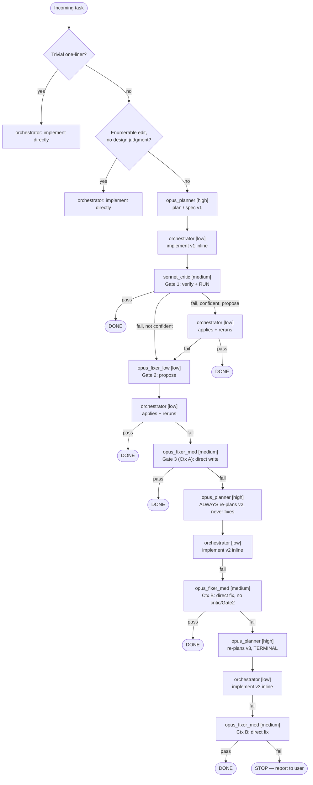

# Orchestration Map

```
Opus     opus_planner [high] — plan/spec (v1). Terminal role when the
         ladder is exhausted: ALWAYS produces a NEW plan/spec (v2, then
         v3 if needed) — NEVER writes or applies code, in any mode, at
         any round. Bounded to 2 re-plan rounds; round 2 is terminal.

Sonnet   orchestrator (session) [low] — route, implement code INLINE
         from spec (v1, v2, AND v3), apply any Gate 1/2 proposed fix
         VERBATIM + rerun the exact check, enforce policies, sweep
         packets

Sonnet   sonnet_critic [medium] — Gate 1, ORIGINAL PLAN ONLY: verify
         vs acceptance criteria, RUN tests/build (no run = no pass);
         propose a fix ONLY when confident (else evidence-only) —
         NEVER applies it itself, orchestrator does. Not used in the
         post-replan retry.

Opus     opus_fixer_low [low] — Gate 2, ORIGINAL PLAN ONLY, escalation
         only: diagnose + propose a fix from a cross-model perspective
         — NEVER applies it, orchestrator does. Not used post-replan.

Opus     opus_fixer_med [medium] — the SOLE direct-write agent, two
         contexts:
           Context A (Gate 3, original plan): after Gate 2's applied
             fix fails, writes + applies directly, ONE shot
           Context B (post-replan retry): after the orchestrator
             implements a re-planned spec, invoked directly — NO
             critic, NO Gate 2 that round — writes + applies
             directly, ONE shot

────────────────────────  ORIGINAL PLAN (v1)  ────────────────────────

opus_planner ─► orchestrator implements ─► sonnet_critic [Gate 1]
 [high] (plan v1)   [low] (inline)          [medium] (verify, run,
                                             propose IF confident)
                                                   │
                     ┌─────────────────────────────┤
                     │ no confident proposal        │ fix proposed
                     │                              ▼
                     │                    orchestrator [low, inline]
                     │                    applies verbatim + reruns
                     │                              │
                     │                    ┌─────────┴─────────┐
                     │                  pass                fail
                     │                    ▼                   │
                     │                  DONE                  │
                     └────────────────────────────────────────┤
                                                                ▼
                                  opus_fixer_low [Gate 2, low]: propose fix
                                       → orchestrator applies + reruns
                                                │ pass → DONE
                                                │ fail
                                                ▼
                                  opus_fixer_med [Gate 3, medium, Ctx A]:
                                  writes + applies directly, ONE shot
                                                │ pass → DONE
                                                │ fail
                                                ▼
                                  ══ LADDER EXHAUSTED ══

────────────────────────  RE-PLAN LOOP (bounded, max 2 rounds)  ────────────────────────

  round 1:  opus_planner [high] — ALWAYS re-plans (v2), NEVER fixes
                → orchestrator implements v2, inline
                     → FAIL → opus_fixer_med [medium, Ctx B]: direct fix
                              (NO critic, NO Gate 2)
                                   │ pass → DONE
                                   │ fail
                                   ▼
  round 2:  opus_planner [high] — re-plans AGAIN (v3, TERMINAL)
                → orchestrator implements v3, inline
                     → FAIL → opus_fixer_med [medium, Ctx B]: direct fix
                                   │ pass → DONE
                                   │ fail
                                   ▼
                         STOP — report to user (no third re-plan, no loops)

Handles:  opus_planner = Opus 5 high (plan/re-plan ONLY, never fixes) ·
          opus_fixer_low = Opus 5 low (Gate 2, propose-only, original
          plan only) · opus_fixer_med = Opus 5 medium (sole direct-write
          agent, both contexts) · sonnet_critic = Sonnet 5 medium (Gate
          1, original plan only) · orchestrator = the session itself
          (Sonnet 5 low, universal fix-executor for Gates 1–2, and
          implementer for every plan version).
          All four registered live in the roster. Fable retired 2026-07-24
          (superseded fable_planner/opus_decomposer/sonnet_reviewer/
          sonnet_scribe/sonnet_fixer_med — the last created and retired
          within this same day). Haiku retired 2026-07-15.

Bound:    at most 2 re-plan rounds, ever. Round 2 is explicitly terminal —
          opus_planner must say so. No third re-plan under any
          circumstance; a failure there is STOP, not another round.

Pricing (2026-07-24, live): Opus 5 = $5/$25 per M in/out. Sonnet 5 = $2/$10
          (intro, through 2026-08-31) or $3/$15 (standard, after). Opus is
          only ~1.7–2.5x Sonnet — not the 5–10x gap of older Claude
          generations. Gate order is NOT dollar-avoidance; it optimizes for
          "does this tier meaningfully raise the odds of a fix."

Routing:  trivial one-liner → orchestrator direct;
          enumerable edits, no judgment → orchestrator direct (no subagent);
          anything needing design judgment → pipeline at opus_planner
          (orchestrator may route straight to opus_fixer_med at its own
          discretion for a spec clearly beyond a first pass — rare).

Policies: ≤ 4 subagents active at a time.
          5-min default budget stated in every subagent prompt; higher
          per-subtask budgets declared up front, else hung → stop.
          Handoffs (avoid when inline suffices) via
          .agentpackets/agentpacket_<UTCstamp>_<from>-to-<to>.md —
          project-local dir, ~/.claude/agentpackets/ fallback (local
          overrides, else inherit); consumer deletes after read;
          stale packets swept at session end. Applying a Gate 1/2 proposed
          fix is NOT a handoff — the orchestrator acts on a subagent's
          returned text within the same turn.
```

## Changelog

### 2026-07-15 → 2026-07-24 (Fable retirement, revision 1 of 4 same-day)

- Fable retired entirely. Planning + terminal fixing both moved to Opus,
  tiered by effort (`high` for planner/terminal, `medium`/`low` for the two
  escalation-fixer tiers) instead of by model.
- `opus_decomposer`'s decompose stage (constants/OOP-defs/pseudocode) is
  gone. The orchestrator now implements directly from `opus_planner`'s
  spec — no intermediate transcription target.
- `sonnet_scribe` retired — no parallel-fan-out transcription role.
- `sonnet_reviewer` renamed `sonnet_critic` and **lost fix rights** — pure
  review/run/report.
- Session model set to `claude-sonnet-5` via `/model` (2026-07-24).
- Ladder at this point: `sonnet_critic` [med, no fix] → `opus_fixer_low`
  [low] → `opus_fixer_med` [medium] → `opus_planner` [high] terminal
  ("repair or re-scope" — later corrected in revision 4).

### Revision 2 of 4, same day (superseded within hours)

- User proposed inserting a same-family Sonnet retry before any Opus
  involvement (Opus 5 at $5/$25/M is only ~1.7–2.5x Sonnet 5, not the 5–10x
  gap of older generations, so a cross-model jump isn't dollar-justified as
  the *first* response to a failure).
- Created `sonnet_fixer_med` [medium], collapsed to a 3-rung ladder,
  dropped the revision-1 `opus_fixer_med` tier.
- **Superseded before being fully propagated** — see revision 3.

### Revision 3 of 4, same day

- User refined: the *apply* step for a proposed fix doesn't need its own
  subagent, since the orchestrator already runs at Sonnet-low.
- `sonnet_fixer_med` retired (created and retired within the same day) —
  diagnostic role folded into `sonnet_critic` (propose-if-confident),
  execution role folded into the orchestrator.
- `opus_fixer_med` **re-created** as Gate 3's direct-write, no-intermediary
  fixer.
- `opus_fixer_low` re-scoped to Gate 2, propose-only, cross-model.
- Terminal step at this point was still `opus_planner` "repair or
  re-scope" — **this was wrong, corrected in revision 4.**

### Revision 4 of 4, same day (current — see map above)

- User caught the overstep directly: *"I didn't want opus-high to fix
  directly. Once things get to opus-high, it replans no matter what. Then
  sonnet-low gives it a shot, and if that fails, then opus-med."*
- `opus_planner`'s "repair" option **removed entirely**. Its terminal role
  is now strictly: produce a new plan/spec, never touch code.
- Clarified via two follow-up questions:
  1. If the post-replan retry (orchestrator + `opus_fixer_med`) also fails,
     escalation bounces back to `opus_planner` for **one more** re-plan —
     bounded to 2 rounds total, not unlimited. Round 2 is explicitly
     terminal.
  2. The post-replan retry **skips both `sonnet_critic` and
     `opus_fixer_low` entirely** — just the orchestrator implementing, then
     `opus_fixer_med` fixing directly if needed. Lighter than the
     original-plan ladder, since the plan itself (not a fresh
     implementation bug) was judged the more likely defect once the full
     3-gate ladder failed.
- `opus_fixer_med`'s contract split into two explicit contexts (A:
  original-plan Gate 3; B: post-replan retry) — same agent, same direct-
  write behavior, different invocation trigger and escalation target.

### Separately, same day: pxpipe/litellm/sdk-shim scope correction

- A `claude-sdk-shim` (FastAPI wrapping claude-agent-sdk) + LiteLLM
  wrapper was built to route subscription-billed Claude through LiteLLM's
  OpenAI-compatible `:4000` gateway, so other harnesses (hermes) could use
  it too.
- **Decommissioned same day** at user's request: pxpipe-proxy was always
  meant to be Claude-Code-only (`ANTHROPIC_BASE_URL` direct), not
  generalized across harnesses via LiteLLM — the Agent SDK route was still
  drawing extra subscription usage regardless (hermes-agent issue #47260),
  so the added complexity wasn't worth it.
- `claude-sdk-shim` NSSM service removed; `litellm_config.yaml` reverted to
  local-ollama-only (no claude-* routes). `pxpipe-proxy` service (:47821)
  unchanged, still the sole Claude Code endpoint.
- These orchestration docs were also moved off `.pi` (which is reserved
  for that unrelated service stack) onto `.claude/docs/`, where the rest
  of this session's config lives.

## AST — orchestrator fan-out (if/else form)

```
orchestrator (session, Sonnet-5 low)
├─ IF trivial mechanical one-liner (typo, rename, no behavior change)
│    └─ implement directly → DONE
│
├─ ELIF fully enumerable edit, no design judgment required
│    └─ implement directly → DONE
│
└─ ELSE  (task needs design judgment)
     └─ CALL opus_planner [high] → plan/spec (v1)
          │
          └─ orchestrator implements v1, inline
               │
               └─ CALL sonnet_critic [medium] → Gate 1: verify + RUN
                    │
                    ├─ IF pass → DONE
                    │
                    └─ IF fail
                         ├─ IF confident → propose fix
                         │    └─ orchestrator applies verbatim + reruns
                         │         ├─ IF pass → DONE
                         │         └─ IF fail → Gate 2
                         └─ IF NOT confident → evidence only → Gate 2
                              │
                              ▼
                    CALL opus_fixer_low [low] → Gate 2: propose fix
                         └─ orchestrator applies verbatim + reruns
                              ├─ IF pass → DONE
                              └─ IF fail
                                   └─ CALL opus_fixer_med [medium]
                                        — Gate 3, Context A: writes +
                                          applies directly
                                        ├─ IF pass → DONE
                                        └─ IF fail
                                             │
                                             ▼
                                   ══ LADDER EXHAUSTED ══
                                             │
                                             ▼
                              CALL opus_planner [high]
                                   — ALWAYS re-plans (v2), NEVER fixes
                                   └─ orchestrator implements v2, inline
                                        └─ IF fail
                                             └─ CALL opus_fixer_med [medium]
                                                  — Context B: direct fix,
                                                    NO critic, NO Gate 2
                                                  ├─ IF pass → DONE
                                                  └─ IF fail
                                                       │
                                                       ▼
                                        CALL opus_planner [high]
                                             — re-plans AGAIN (v3, TERMINAL)
                                             └─ orchestrator implements v3
                                                  └─ IF fail
                                                       └─ CALL opus_fixer_med
                                                            [medium]
                                                            — Context B:
                                                              direct fix
                                                            ├─ IF pass
                                                            │  → DONE
                                                            └─ IF fail
                                                                 └─ STOP
                                                                    report
                                                                    to user,
                                                                    full
                                                                    evidence
                                                                    trail,
                                                                    NO third
                                                                    re-plan
```


