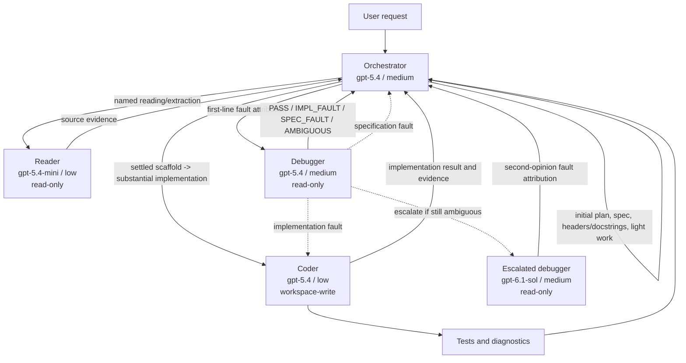

# Diagram 1

```mermaid
flowchart TD
    User[User request] --> O[Orchestrator<br/>gpt-5.4 / medium]
    O -->|initial plan, spec, headers/docstrings, light work| O
    O -->|settled scaffold -> substantial implementation| C[Coder<br/>gpt-5.4 / low<br/>workspace-write]
    O -->|named reading/extraction| R[Reader<br/>gpt-5.4-mini / low<br/>read-only]
    O -->|first-line fault attribution| D[Debugger<br/>gpt-5.4 / medium<br/>read-only]
    C -->|implementation result and evidence| O
    R -->|source evidence| O
    D -->|PASS / IMPL_FAULT / SPEC_FAULT / AMBIGUOUS| O
    D -.escalate if still ambiguous.-> S[Escalated debugger<br/>gpt-6.1-sol / medium<br/>read-only]
    S -->|second-opinion fault attribution| O
    D -.implementation fault.-> C
    D -.specification fault.-> O
    C --> V[Tests and diagnostics]
    V --> O
```
