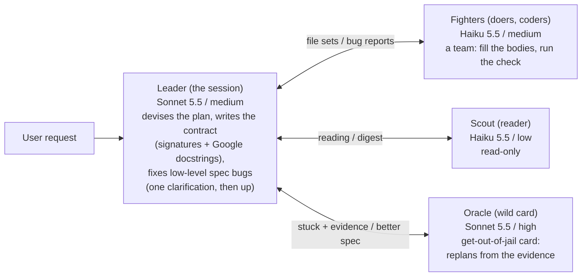

```mermaid
flowchart LR
    User[User request] --> L["Leader (the session)<br/>Sonnet 5.5 / medium<br/>devises the plan, writes the contract<br/>(signatures + Google docstrings),<br/>fixes low-level spec bugs<br/>(one clarification, then up)"]

    L <-->|"file sets / bug reports"| F["Fighters (doers, coders)<br/>Haiku 5.5 / medium<br/>a team: fill the bodies, run the check"]
    L <-->|"reading / digest"| S["Scout (reader)<br/>Haiku 5.5 / low<br/>read-only"]
    L <-->|"stuck + evidence / better spec"| O["Oracle (wild card)<br/>Sonnet 5.5 / high<br/>get-out-of-jail card:<br/>replans from the evidence"]
```
